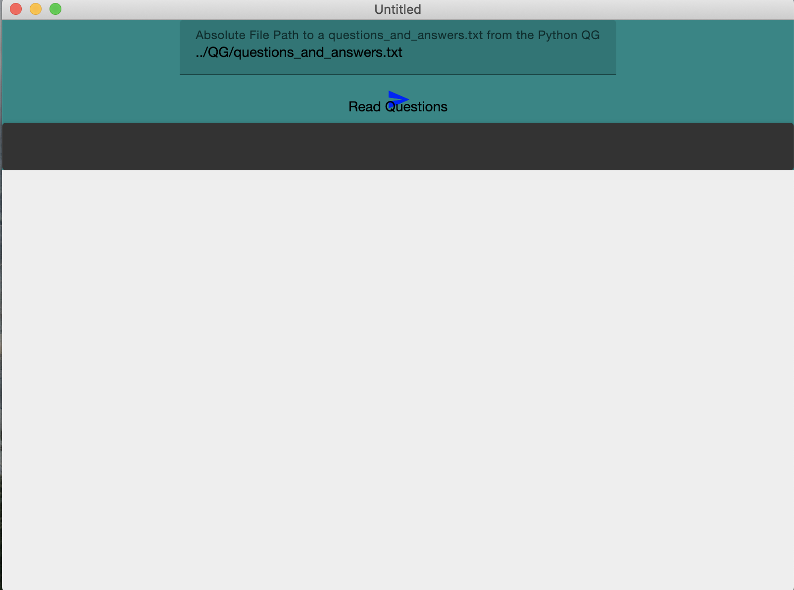
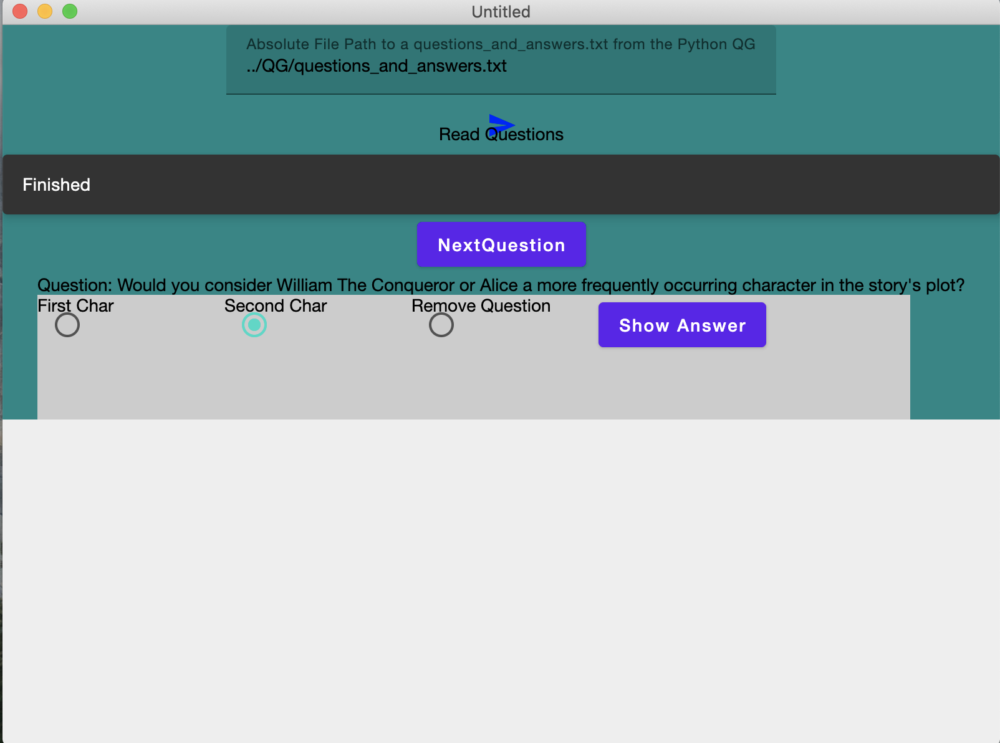
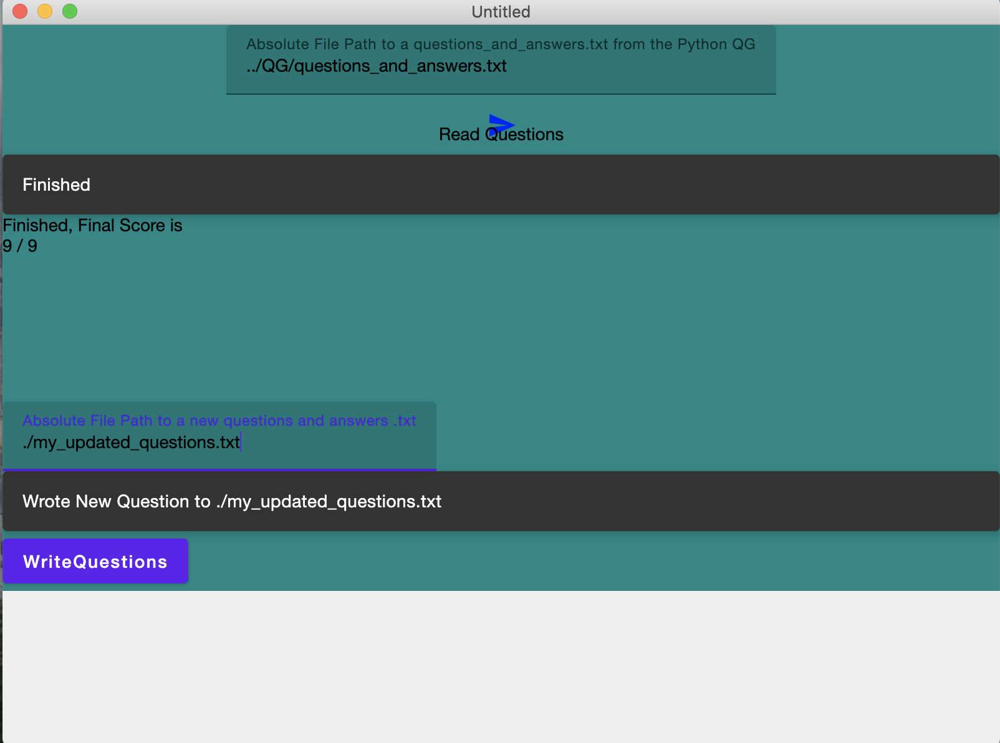

# QgClassics
This is a Question Generation (QG) system focusing on extracting information from classic literature then turning this information into questions and answers. 

The software works by running a Named Entity recognition model (NER) model over literature books to identify characters. The characters are then built into a graph where nodes are characters and edges are relationships, both edges and nodes are represented by frequency and sentiment. 
A question generation templates is the applied to graph to generate questions. 
A desktop app was built to read the auto generated questions and answers to present a quiz to the user. Below is instructions on running the system locally. 

Presentations Below:

Milestone 1: https://youtu.be/N0EQVSz0ZfA

Milestone 2: https://youtu.be/UzdLymEOwHs

Final: https://youtu.be/K4-c4CJiZXY

# Example of Knowledge Graph From Dracula from Bram Stoker 

# User Manual 
Requirements: Python 3 with and Mac OS or Linux OS (Tested on Mac OS Catalina and Ubuntu 20.04). Anaconda and python 3.8+ recommended. 

## 1. Open a terminal in the project directory
Open a terminal in the directory of the unzipped project folder and run `cd /QgClassics`.

## 2. Install requirements 
Install python requirements with the command `conda env create -f requirements.yml` (some form of virtual env is recommended, conda is a great option)

If not using Anaconda use `python -m pip install requirementsPIP.txt` make sure python is version 3+ with `python -V` if not try using `python3` instead of `python`. If you don't have pip run `python -m ensurepip --upgrade` or `sudo apt install python3-pip` on linux. Help from https://pip.pypa.io/en/stable/installation/ also can help troubleshoot. 

## 3. Activate Env
If using Anaconda activate the env with `conda activate qgEnv`

## 4. Install pretrained model 
Install the NER Model from spacy with `python -m spacy download en_core_web_lg` For more info: https://docs.conda.io/projects/conda/en/latest/user-guide/tasks/manage-environments.html

## 5. Run the QG backend 
First run `cd QG` then run the Question Generation System with the command `python characterNER.py PATH_TO_BOOK.txt` you can use `python characterNER.py ../Data/books/Dracula.txt`. 
This creates a `questions_and_answers.txt` with all generated questions. It also creates a file that is a picture of the character network for the books and a .gml file which is a file for the graph itself, each output is provided but running will create new ones. . The `PATH_TO_BOOK.txt` needs to be a `.txt` file containing a book. Program was originally tested on books from Project Gutenburg. https://www.gutenberg.org/browse/scores/top. There are two books provided: Alice's Adventures in Wonderland by Lewis Carroll and Dracula by Bram Stoker (found in `QgClassics/Data/books/`). Both are distributed through Project Gutenburg and are under public domain. I am providing them as a way to test the given tool. They are provided although should the reader wish they can view their direct sources:https://www.gutenberg.org/ebooks/11 https://www.gutenberg.org/ebooks/345

## 6. Install front end 
Install the app from the  under `QgClassicsInstalls/` select the install for you operating system (Mac and Debian installs available)

## 7. Using the app 

Enter the path (Absolute Path works best) to the `questions_and_answers.txt` generated in step 5. There is a provided `questions_and_answers.txt` at `/QgClassics/QG/questions_and_answers.txt`

## 8. 
After selecting read questions quiz questions will be presented one at a time to the user. The user can select the either the correct answer or choose to remove the question if they think it is of poor quality. Also, the user can be shown the answer if they choose. 

## 9.
Once the quiz is complete the the user will be shown their score. They can also select a path to write the new questions to with the chosen questions removed. 

